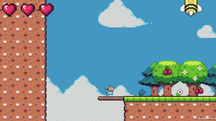
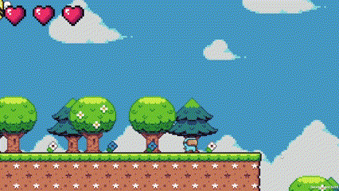

# Virtual Fruits
Virtual Fruits is a 2D platformer video game with pixel-art style and metroidvania-like progression for PC. Set in the paradisiacal island of Fruitua, you will be able to take control of a masked character who is yet to become the 'hero' of the island. All thanks to the different acrobatics that you will obtain and the enemies that you will fight against making use of the special powers granted by the fruits of Fruitua. 

For more information refer to the [Game Design Document](https://docs.google.com/document/d/1lJiy592_JxmwuRkl_hvUobWLtROLymsCWQBHJLBjCwA/edit?usp=sharing) (only in Spanish)

---

## Implementation summary
| **Implemented**            | **Not implemented**                                 |
|----------------------------|-----------------------------------------------------|
| Character movement &check; | Character movement progression &cross;              |
| Spring enemies &check;     | Full controller compatibility &cross;               |
| Combat system &check;      | Autumn, Winter and Summer zones and enemies &cross; |
| Secret zones &check;       |                                                     |
| Spring zone &check;        |                                                     |
| Items &check;              |                                                     |

---

## Progress showcase

**Character movement**  

**Spring enemies**  

|               Snail               |               Bee                | 
|:---------------------------------:|:--------------------------------:|
|  |      |
|             **Bunny**             |            **Plant**             |
|   |  |

### Work in progress
* Controller compatibility (almost done)
* Autumn zone
* Autumn enemies
* UI improvement

